# TOOLING WEBSITE DEPLOYMENT AUTOMATION WITH CONTINUOUS INTEGRATION.

#### What is Continuous Integration

Continuous Integration refers to a development approach where developers need to frequently commit changes to the source code in a shared repository, often multiple times a day. With each commit, the code is compiled and processed, enabling teams to promptly identify issues. Additionally, depending on the specific Continuous Integration tool used, there are various supplementary features available, such as deploying the built application to a testing server and sharing the resulting builds and test outcomes with relevant teams.

#### Introduction To Jenkins
Jenkins, a Java-based open-source automation tool, comes equipped with plugins tailored for continuous integration. Its primary function involves the perpetual building and testing of software projects. This streamlines the process of developers incorporating changes into the project and enables users to access newly compiled versions effortlessly. Moreover, Jenkins facilitates the uninterrupted delivery of software by seamlessly integrating with a wide array of testing and deployment technologies.

Through the utilization of Jenkins, organizations can expedite software development through automated means. The tool harmonizes a variety of development life-cycle processes, encompassing building, documentation, testing, packaging, staging, deployment, static analysis, and more.

Continuous Integration is realized within Jenkins thanks to its plugin system. These plugins enable the assimilation of diverse DevOps stages. To integrate a specific tool, the corresponding plugins must be installed. For instance, tools like Git, Maven 2 projects, Amazon EC2, HTML publisher, and others require their respective plugins for integration.

The illustration provided illustrates the integration of different DevOps phases by Jenkins.


**Enhance the architecture prepared in [Load Balancing With Apache](https://github.com/Gshare-dev/Load-Balancing-With-Apache.git) by adding a Jenkins server, configure a job to automatically deploy source codes changes from Git to NFS server.**


#### Step 1- Install Jenkins server
1. Create an AWS EC2 server based on Ubuntu Server 20.04 LTS and name it "Jenkins"
2. Install JDK (Java development kit) since Jenkins is a Java-based application:
```
sudo apt update
```
    sudo apt install openjdk-11-jdk -y

Follow by adding the Jenkins repository and Key since they are not added by default in Ubuntu 22.04:

```
curl -fsSL https://pkg.jenkins.io/debian-stable/jenkins.io-2023.key | sudo tee \
  /usr/share/keyrings/jenkins-keyring.asc > /dev/null
```
    echo deb [signed-by=/usr/share/keyrings/jenkins-keyring.asc] \
    https://pkg.jenkins.io/debian-stable binary/ | sudo tee \
    /etc/apt/sources.list.d/jenkins.list > /dev/null

3. Install Jenkins:
```
sudo apt update -y
```
    
    sudo apt install jenkins -y

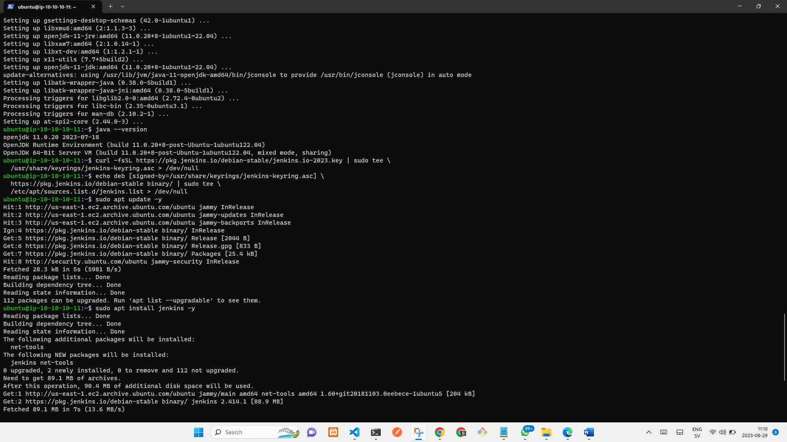

4. Make sure Jenkins is up and running:  `sudo systemctl start jenkins && sudo systemctl enable jenkins` and `sudo systemctl status jenkins`


5. By default Jenkins server uses TCP port 8080 – open it by creating a new Inbound Rule in your jenkins Server EC2 Security Group
6. Next, setup Jenkins. From your browser access `http://<Jenkins-Server-Public-IP-Address-or-Public-DNS-Name>:8080` You will be prompted to provide a default admin password
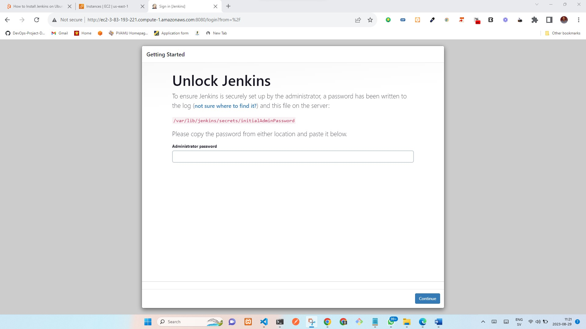

7. Retrieve the password from your Jenkins server: `sudo cat /var/lib/jenkins/secrets/initialAdminPassword` you will see the password for your jenkins that looks like the below on your terminal
   **f5b998fc13f0444980675f1b7058a503**

8. Copy the password from the server and paste on Jenkins setup to unlock Jenkins.
9. Next, you will be prompted to install plugins – **choose suggested plugins**
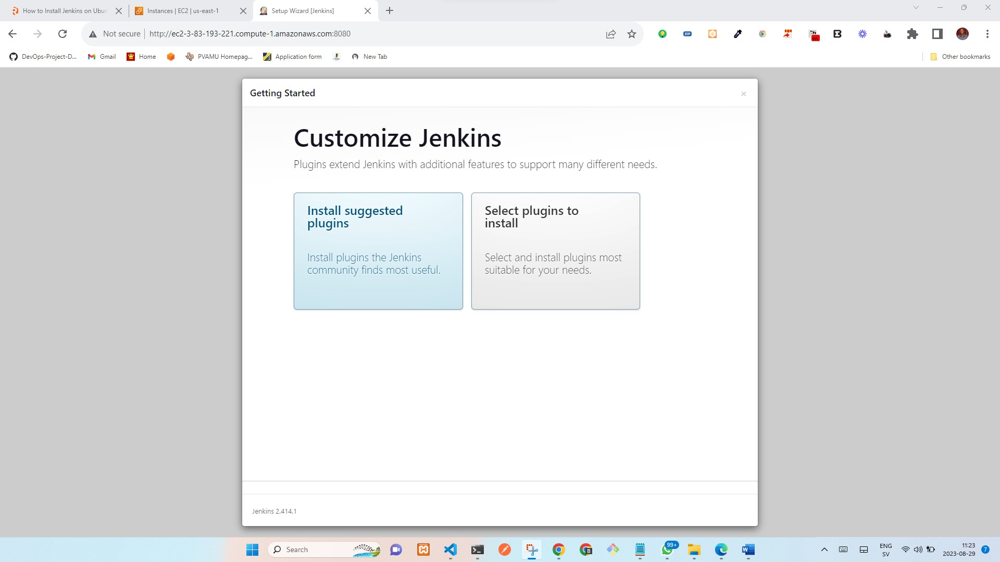

10. Once plugins installation is done – create an admin user and you will get your Jenkins server address. **The installation is completed!** I decided to use my Admin User.
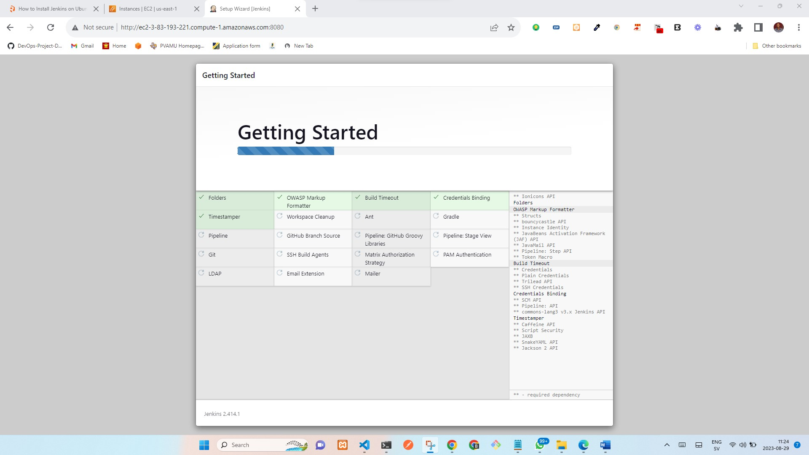
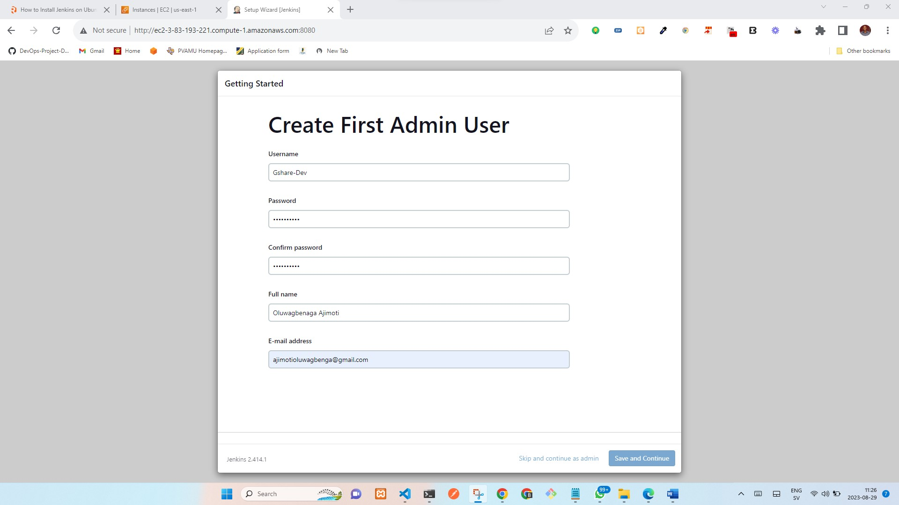

#### Step 2 - Configure Jenkins to retrieve source codes from GitHub using Webhooks
Here I configure a simple Jenkins job/project. This job will will be triggered by GitHub webhooks and will execute a ‘build’ task to retrieve codes from GitHub and store it locally on Jenkins server.

1. Enable webhooks in your GitHub repository settings: 
```
Go to the tooling repository
Click on settings
Click on webhooks on the left panel
On the webhooks page under Payload URL enter: `http:// Jenkins server IP address/github-webhook`
Under content type select: application/json
Then add webhook
```
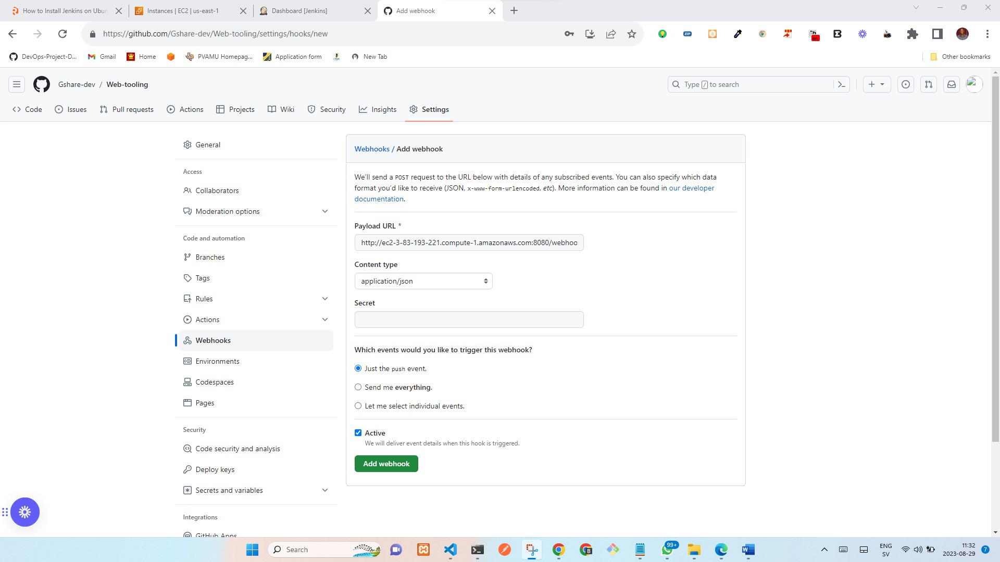

2. Go to Jenkins web console, click **New Item** and create a **Freestyle project** and click OK
3. Connect your GitHub repository, copy the repository URL from the repository
4. In configuration of your Jenkins freestyle project under Source Code Management select **Git repository**, provide there the link to your Tooling GitHub repository and credentials (user/password) so Jenkins could access files in the repository.

Note, change the **Branches to build** to **main** from **master**

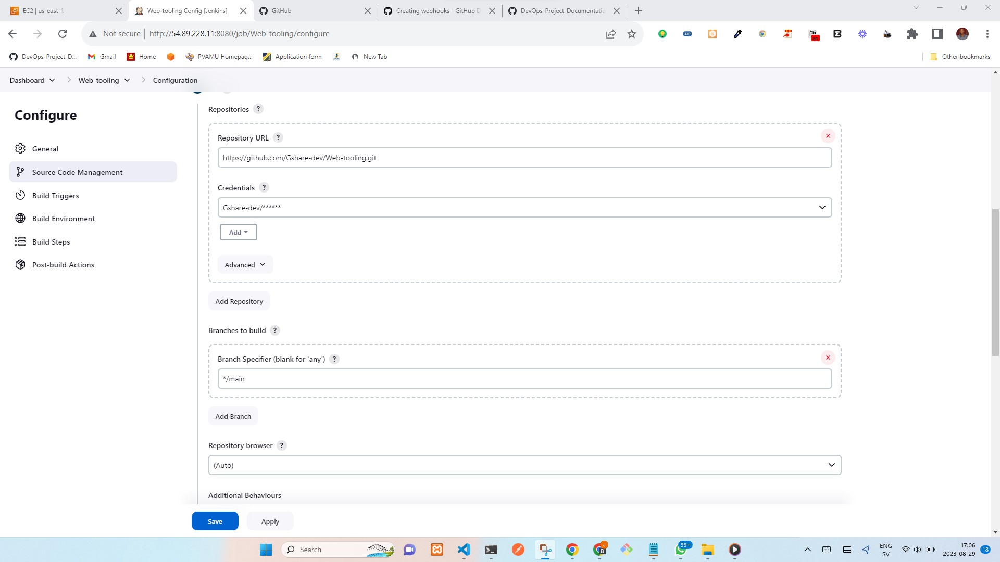

5. Save the configuration and let us try to run the build. For now we can only do it manually.
6. Click **Build Now** button, if you have configured everything correctly, the build will be successfull and you will see it under **#1**
7. Open the build and check in **Console Output** if it has run successfully.
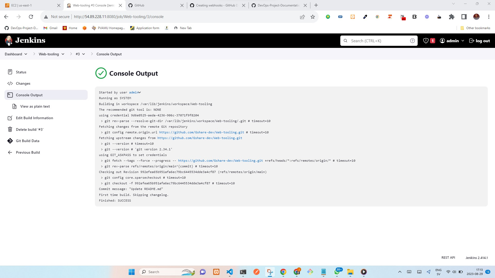

This build does not produce anything and it runs only when it is triggered manually. Let us fix it.
8. Click **Configure** your job/project and add and save these two configurations:
``` 
Under **Build triggers** select: Github trigger for GITScm polling
Under **Post Build Actions** select Archieve the artifacts and enter `**` in the text box.
```
9. Now, go ahead and make some change in any file in your GitHub repository (e.g. README.MD file) and push the changes to the master branch.
10. You will see that a new build has been launched automatically (by webhook) and you can see its results – artifacts, saved on Jenkins server.
11. We have successfully configured an automated Jenkins job that receives files from GitHub by webhook trigger (this method is considered as ‘push’ because the changes are being ‘pushed’ and files transfer is initiated by GitHub).
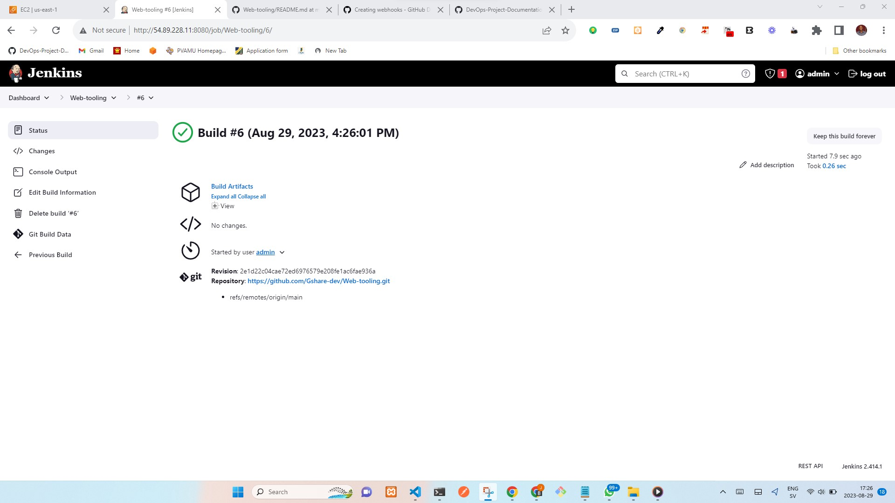

12. By default, the artifacts are stored on Jenkins server locally: `ls /var/lib/jenkins/jobs/tooling_github/builds/<build_number>/archive/`

#### Step 3 – Configure Jenkins to copy files to NFS server via SSH
1. Now we have our artifacts saved locally on Jenkins server, the next step is to copy them to our NFS server to /mnt/apps directory. We need a plugin called
**Publish over SSh**
2. Install "Publish Over SSH" plugin.
3. Navigate to the dashboard select **Manage Jenkins** and choose **Manage Plugins** menu item.
4. On **Available** tab search for **Publish Over SSH** plugin and install it
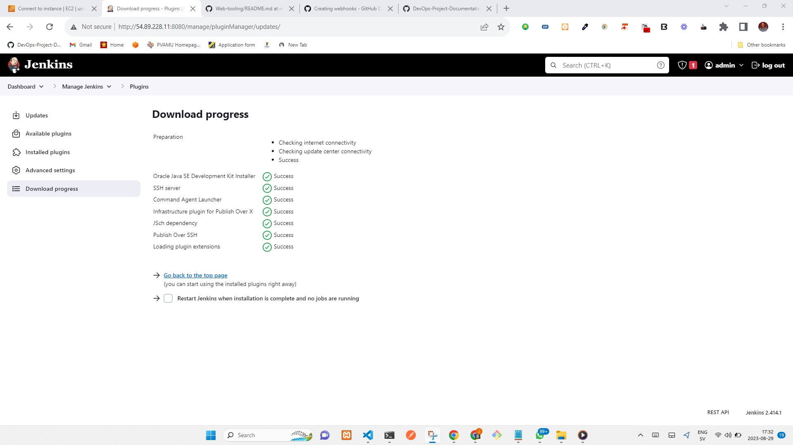

5. Configure the job/project to copy artifacts over to NFS server.
6. On main dashboard select **Manage Jenkins** and choose **Configure System** menu item.
7. Scroll down to Publish over SSH plugin configuration section and configure it to be able to connect to your NFS server:
```
Provide a private key (content of .pem file that you use to connect to NFS server via SSH/Putty)
Name- NFS
Hostname – can be private IP address of your NFS server
Username – ec2-user (since NFS server is based on EC2 with RHEL 8)
Remote directory – /mnt/apps since our Web Servers use it as a mointing point to retrieve files from the NFS server
```
8. Test the configuration and make sure the connection returns **Success** Remember, that TCP port 22 on NFS server must be open to receive SSH connections.
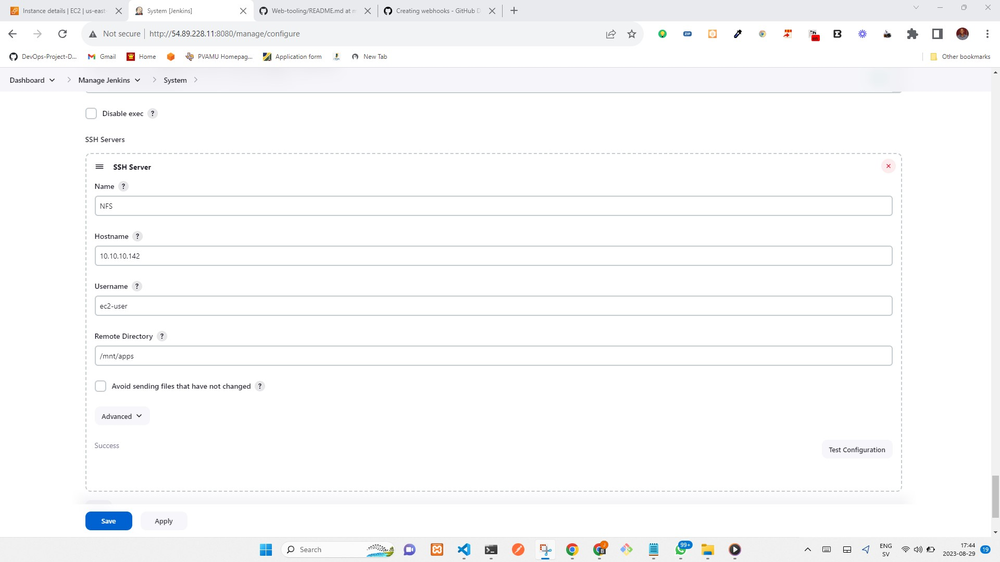
9. Save the configuration and open your Jenkins job/project configuration page and add another one Post-build Action: **Set build actifact over SSH**
10. Configure it to send all files probuced by the build into our previouslys define remote directory. In our case we want to copy all files and directories – so we use **

11. Save this configuration and go ahead, change something in **README.MD** file the GitHub Tooling repository.
12. Webhook will trigger a new job and in the "Console Output" of the job you will find something like this:
```
SSH: Transferred 25 file(s)
Finished: SUCCESS
```
13. To make sure that the files in /mnt/apps have been updated – connect via SSH/Putty to your NFS server and check README.MD file: `cat /mnt/apps/README.md`
14. If you see the changes you had previously made in your GitHub – the job works as expected.

**Note** I got a "Permission denied" error which indicated that my build was not successful
this issue was resolved by changing mode and ownership on the NFS server with the below command:
```
ll /mnt
sudo chown -R nobody:nobody /mnt
sudo chmod -R 777 /mnt
```
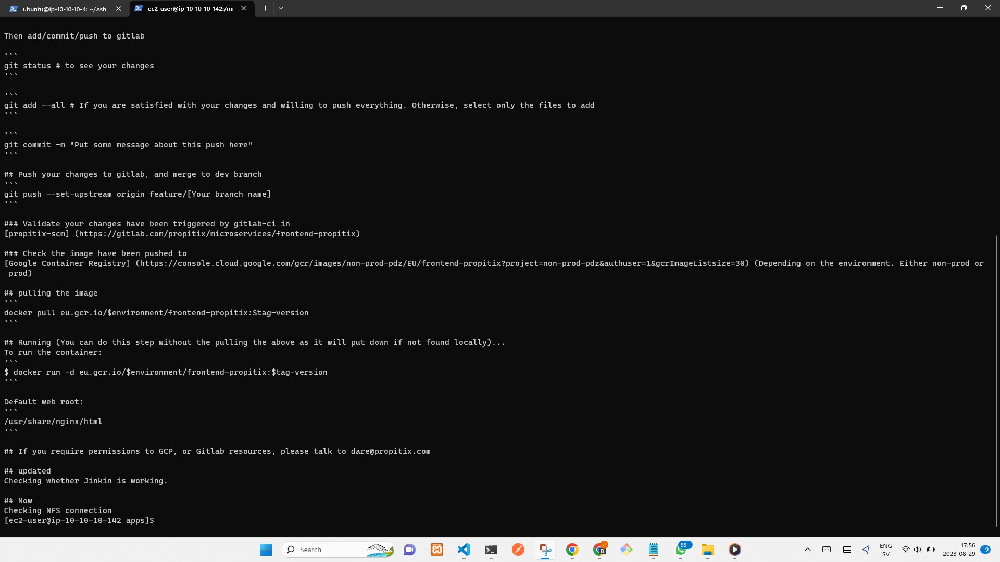


